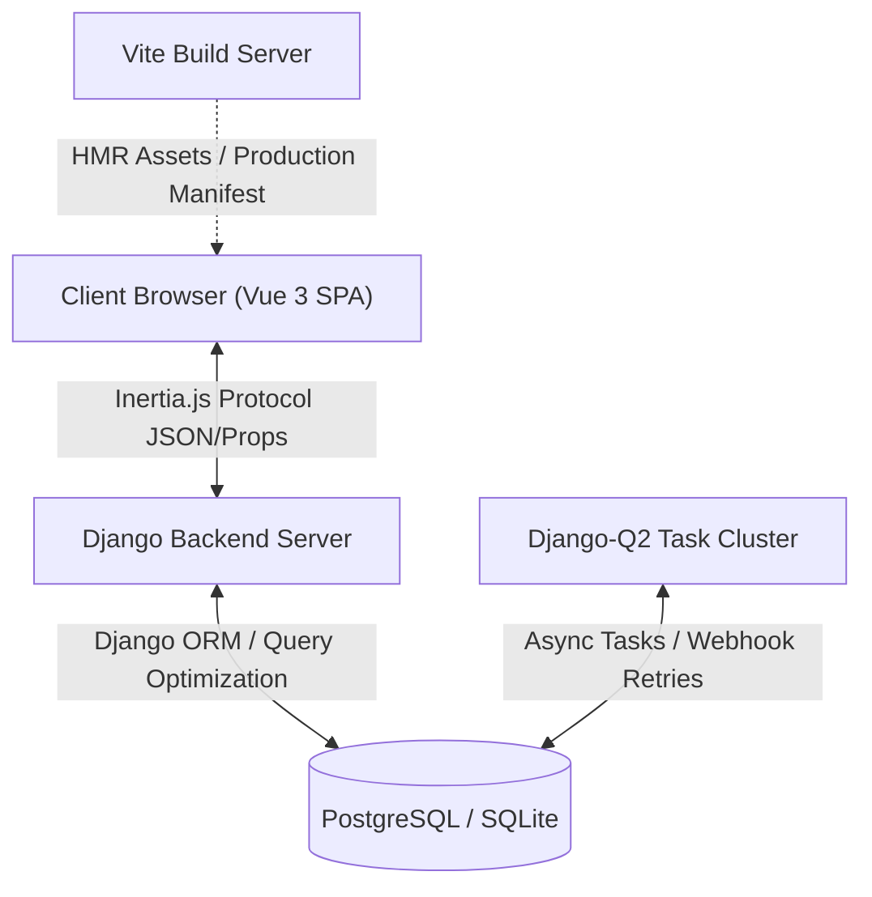
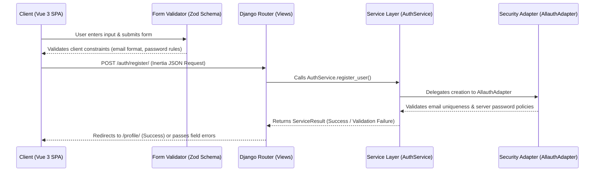

# 🌌 Comprehensive Technical Architecture Document — AuraFlow Engine

This document details the software architecture, technical integrations, data flows, and design decisions of the **AuraFlow** SaaS Boilerplate & Internal Tools Engine.

---

## 🏛️ System Architecture Overview

AuraFlow follows a **Modern Hybrid Architecture** that pairs Django's enterprise-grade backend security and ORM capabilities with Vue 3's reactive Single Page Application (SPA) frontend user experience using **Inertia.js** as a direct protocol bridge—eliminating the need for separate REST API boilerplate or JWT token management overhead.

---

## 🔧 Technical Components Breakdown

### 1. Backend Nucleus (Django 5.1 LTS)
Serves as the system core responsible for:
* **Identity & Security Guardrails:** Protection against OWASP top threats (CSRF, SQL Injection, XSS) using secure session cookies.
* **Database & Custom User ORM:** Custom `CustomUser` model inheriting from `AbstractUser` and `TimeStampedModel`, utilizing UUID primary keys and username-less email authentication.
* **django-allauth Integration:** Underpins account lifecycle, password resets, social connections, and Time-based One-Time Password (TOTP) Multi-Factor Authentication (MFA).

### 2. Protocol Bridge (Inertia.js)
The smart data-bridge enabling a full SPA experience powered by server-side routing:
* Intercepts standard HTTP requests and returns JSON payloads containing reactive `props` and target Vue `component` declarations.
* Handles page transitions dynamically without full page reloads while maintaining browser history state and URL routing.

### 3. Reactive Frontend (Vue 3 Composition API)
* Single File Components (`.vue`) engineered with `<script setup lang="ts">`.
* Client-side validation powered by **Zod v4** integrated into **VeeValidate**.
* Global state management via **Pinia** and reactive toast notifications via `useToast`.

### 4. Styling Engine (Tailwind CSS v4)
* Modern CSS-first architecture eliminating legacy `tailwind.config.js` configurations.
* Dynamic Dark/Light mode theme switching driven by native CSS variables and `.dark` HTML root class toggles.

### 5. Bundler & Asset Pipeline (Vite 8 & django-vite)
* **Development Mode:** Runs on port `5173` providing instant Hot Module Replacement (HMR).
* **Production Mode:** Reads `static/dist/.vite/manifest.json` asset manifests to inject optimized JS/CSS bundles directly into Django root layout templates.

---

## 🔄 User Registration & Data Lifecycle

When a user initiates account registration, the data flows through the following pipeline:

---

## 🧪 Quality Assurance & Test Engineering

AuraFlow features an extensive testing suite covering unit, integration, and E2E browser behavior:

### 1. Backend & Unit Testing (Pytest)
* Model tests verifying custom constraints, UUID generation, and soft-delete behaviors.
* Service tests (`AuthService`, `WorkspaceService`) verifying audit trail logging and role assignment.
* Security tests targeting N+1 query detection, tenant isolation, workspace lockout states, and webhook signature verifications.

### 2. End-to-End Browser Automation (Playwright)
* Automated Chromium execution simulating authentic end-user sessions.
* Verifies registration, login, profile updates, and dynamic DOM theme updates (`.dark` CSS verification).

---

## 📂 Architectural Decision Records (ADRs)

### [ADR-01] Adoption of Inertia.js Monolith-SPA Bridge
- **Decision:** Connect Django and Vue 3 using Inertia.js instead of building separate REST/GraphQL endpoints.
- **Rationale:** Combines the rapid development velocity and robust session security of Django with the rich interactivity of a Vue SPA, avoiding double-definition of API schemas and token storage security risks.

### [ADR-02] Vue 3 Wrappers for All Security & Auth Views
- **Decision:** Convert all `django-allauth` HTML template views into Vue 3 SPA components rendered via Inertia.
- **Rationale:** Prevents full-page browser reloads during authentication, MFA onboarding, and password changes, maintaining a 100% pure SPA user experience.

### [ADR-03] Custom Zod v4 VeeValidate Schema Adapter
- **Decision:** Author a lightweight schema bridge (`zodSchema.ts`) connecting Zod v4 with VeeValidate instead of relying on legacy third-party packages.
- **Rationale:** Ensures early adoption of Zod v4 features while keeping validation logic lightweight and type-safe across the codebase.

### [ADR-04] Dual Password Validation & Field Error Mapping
- **Decision:** Mirror password strength validation between client Zod schemas and server Django validators, mapping any caught server `ValidationError` directly to the `password` field input key in Vue.
- **Rationale:** Delivers instant field-level feedback under password inputs rather than displaying generic page alerts.

### [ADR-05] Decoupled Service & Selector Layer
- **Decision:** Enforce class-based `Services` for write operations and `Selectors` for read queries, separating business logic from views and middleware.
- **Rationale:** Keeps views thin and eliminates $N+1$ database queries through standardized `select_related` and `prefetch_related` calls.

### [ADR-06] Non-Root Multi-Stage Docker Containerization
- **Decision:** Build production images using a multi-stage Dockerfile running under an unprivileged user (`appuser`, UID 10000) with container healthchecks.
- **Rationale:** Prevents container breakout vulnerabilities, meets OWASP security standards, and minimizes production image size.

### [ADR-07] Automated CI/CD Quality Pipeline
- **Decision:** Configure GitHub Actions workflows (`ci.yml`) to enforce code formatting (Ruff), migration consistency checks, and full Pytest execution on every push/PR.
- **Rationale:** Guarantees zero regression bugs reach the production main branch.
