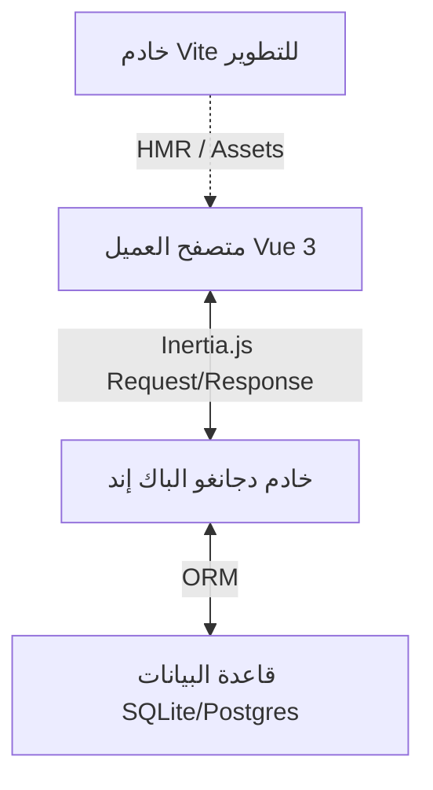
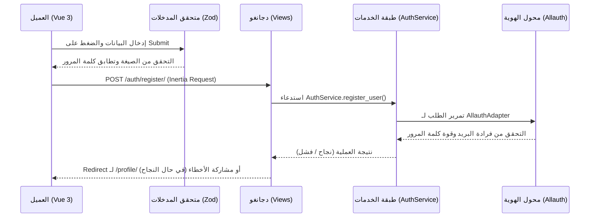

# 🌌 التوثيق التقني الشامل لمنصة AuraFlow

تركز هذه الوثيقة على شرح البنية البرمجية، وتكامل التقنيات المستخدمة في منصة **AuraFlow**، وكيفية تفاعل المكونات المختلفة لتوفير تجربة تطوير سريعة وآمنة.

---

## 🏛️ الهيكل الفني للمشروع (Architecture Overview)

يعتمد مشروع AuraFlow على نمط الهجين الحديث (Modern Hybrid) الذي يجمع بين قوة أمان الباك إند في دجانغو، وديناميكية الفرونت إند في Vue 3 باستخدام **Inertia.js** كوسيط، بدون الحاجة لبناء خادم API مستقل (مثل REST أو GraphQL).

---

## 🔧 المكونات التقنية بالتفصيل

### 1. دجانغو (Django 5.2.x LTS)
يمثل نواة النظام والمسؤول عن:
*   **إدارة الهوية والتأمين:** التحقق من الهجمات (CSRF, SQL Injection, XSS) وجلسات العمل المؤمنة عبر الكوكيز (Secure Session Cookies).
*   **قاعدة البيانات (ORM):** نموذج المستخدم المخصص `CustomUser` الممتد لإضافة التفضيلات الشخصية (المظهر واللغة والمنطقة الزمنية).
*   **django-allauth:** توفير النظام الأمني الخلفي للتسجيل وتغيير كلمات المرور، ودعم التحقق الثنائي (MFA).

### 2. إينيرشيا (Inertia.js)
جسر الربط الذكي الذي يسمح لك ببناء تطبيق Single Page App (SPA) كامل دون تعقيدات:
*   يقستقبل الـ Requests من العميل ويرسل ردوداً بصيغة JSON تحتوي على البيانات (`props`) واسم المكون (`component`).
*   يقوم تلقائياً بتحميل وتحديث المكونات في المتصفح دون إعادة تحميل الصفحة (Full Page Reload)، مع الحفاظ على الـ Routing وحالة التطبيق.

### 3. فيو (Vue 3 - Composition API)
لإدارة الواجهات وتفاعل المستخدم:
*   كتابة المكونات بنظام Single File Components (`.vue`).
*   استخدام **VeeValidate** بالتكامل مع **Zod v4** للتحقق من صحة المدخلات في المتصفح فورياً (Client-side Validation).

### 4. تايلوند (Tailwind CSS v4)
تنسيق فخم وعصري بأحدث جيل من Tailwind:
*   الاعتماد على إعدادات CSS-first بالكامل (بدون الحاجة لملف `tailwind.config.js`).
*   تطبيق فوري للسمات (المظهر الداكن والخفيف) باستخدام متغيرات CSS المتناغمة مع كلاس `.dark` في وسم `<html>`.

### 5. أداة التجميع (Vite 8 & django-vite)
*   **في التطوير (Development):** تشغيل خادم محلي على منفذ `5173` لتوفير ميزة التحديث الفوري للأكواد (HMR).
*   **في الإنتاج والاختبارات (Production/Testing):** قراءة ملف المانيفست المجمع `static/dist/.vite/manifest.json` لحقن الملفات المضغوطة ذاتياً دون الحاجة لتشغيل خادم إضافي.

---

## 🔄 دورة حياة البيانات والتسجيل (Data Lifecycle)

عند قيام مستخدم بإنشاء حساب جديد، تمر البيانات بالخطوات التالية:

---

## 🧪 استراتيجية الاختبارات الجودة (QA & Testing)

يحتوي المشروع على بيئة اختبار متكاملة وقوية تضمن استقرار الكود قبل الرفع:

### 1. الاختبارات الفردية واختبارات الخدمات (Pytest)
*   اختبارات النموذج والموديل لتأكيد الحقول الافتراضية.
*   اختبارات الخدمات (`AuthService`) للتأكد من تتبع البيانات الأمنية (Audit Logs) وتصنيف الأخطاء بدقة.
*   تم ضبط معالج عدم التزامن `DJANGO_ALLOW_ASYNC_UNSAFE = "true"` لتمكين فحص قاعدة البيانات بأمان.

### 2. الاختبارات الشاملة (E2E Playwright)
*   تشغيل متصفح Chromium حقيقي آلياً.
*   محاكاة كتابة البيانات، الضغط على الأزرار، والتحقق من التوجيه التلقائي للملف الشخصي.
*   التحقق من تفعيل المظهر الداكن بصرياً في المتصفح عبر قراءة كود الـ DOM والـ CSS الفعلي.
*   تتكامل تلقائياً مع ملفات الإنتاج المبنية لضمان مطابقتها لما سيراه المستخدم النهائي.

---

## 📂 سجل القرارات المعمارية (Architectural Decision Records - ADRs)

### [ADR-01] استخدام معمارية Inertia.js لربط الواجهة الأمامية بالخلفية
- **القرار**: ربط دجانغو بـ Vue 3 باستخدام **Inertia.js** بدلاً من بناء خوادم API منفصلة (REST/GraphQL).
- **السبب**: يجمع هذا النمط بين سرعة تطوير خوادم Django التقليدية وسرعة وتفاعل تطبيقات الصفحة الواحدة (SPA)، مع الحفاظ على أمان الجلسات وحماية الـ CSRF بشكل افتراضي دون تعقيدات إضافية.

### [ADR-02] تحويل كافة واجهات المصادقة والأمان إلى مكونات Vue 3
- **القرار**: تحويل صفحات الأمان والمصادقة الثنائية الخاصة بـ `django-allauth` من قوالب HTML التقليدية إلى مكونات Vue 3 تُرندر بالكامل عبر Inertia.
- **السبب**: يمنع هذا القرار حدوث أي إعادة تحميل كامل للمتصفح (Full Page Reload) أثناء إدارة تفضيلات الحساب وتغيير كلمات المرور، مما يضمن تجربة مستخدم موحدة (Pure SPA Experience) بنسبة 100%.

### [ADR-03] بناء محوّل مخصص لتكامل Zod v4 مع VeeValidate
- **القرار**: كتابة محول مخصص `zodSchema.ts` لربط Zod v4 بمكتبة VeeValidate بدلاً من استخدام `@vee-validate/zod`.
- **السبب**: لتسريع تبني أحدث إصدارات Zod v4 في عام 2026 وتلافي عدم توافقية المكتبات الجانبية، مع الحفاظ على كود الفحص خفيفاً وسهلاً للصيانة.

### [ADR-04] تطبيق التحقق الثنائي لكلمات المرور وتعيين الأخطاء المباشرة
- **القرار**: مزامنة قواعد فحص كلمات المرور بين المتصفح (عبر Zod) والخادم (عبر Django Validators)، مع إعادة تعيين الأخطاء الواردة من الباك إند وربطها برمجياً بالحقول المعنية (`password`) بدلاً من مشاركتها كرسائل عامة.
- **السبب**: لتحسين تجربة المستخدم وعرض رسائل الخطأ التفصيلية (مثل كلمة مرور شائعة أو ضعيفة) بجوار حقل الإدخال مباشرة، مما يسهل على المستخدم فهم المشكلة وحلها وتلافي غموض رسائل الأخطاء العامة.

### [ADR-05] عزل منطق الاستعلامات والعمليات (Selectors & Services)
- **القرار**: تطبيق نمط الـ Selectors لجلب البيانات ونمط الـ Services لتعديلها وحفظها في قاعدة البيانات، وعزلها بالكامل عن الـ Views والـ Middleware.
- **السبب**: لإبقاء الـ Views نحيفة جداً وخالية من منطق قاعدة البيانات (Thin Views)، ولمنع استعلامات $N+1$ المتكررة عن طريق الاستعلام المنظم والـ caching الموضعي والـ `select_related`/`prefetch_related` الموحدة.

### [ADR-06] بيئة تشغيل آمنة للإنتاج باستخدام Docker
- **القرار**: إعداد ملف Dockerfile متعدد المراحل (Multi-stage) مع تقييد صلاحيات التشغيل لمستخدم غير مميز (Non-root user) وتفعيل فحص الصحة (Healthcheck).
- **السبب**: لمنع ثغرات الحاويات (Container Breakout) وحماية نظام التشغيل المضيف للإنتاج، مع الحفاظ على الحجم الأدنى للـ Image باستبعاد ملفات التطوير والمصادر المحلية غير المستعملة.

### [ADR-07] التحقق وضمان الجودة المستمر (CI/CD Pipeline)
- **القرار**: إعداد نظام للتحقق المستمر باستخدام GitHub Actions للتحقق من جودة الكود محلياً قبل الدمج للـ main branch.
- **السبب**: لضمان أن التحديثات الجديدة لا تكسر أي من الـ 32 اختباراً التلقائي، ولمطابقة معايير جودة الكود وتنسيق بايثون (Ruff) وسلامة مهاجرات قواعد البيانات (Migrations).

