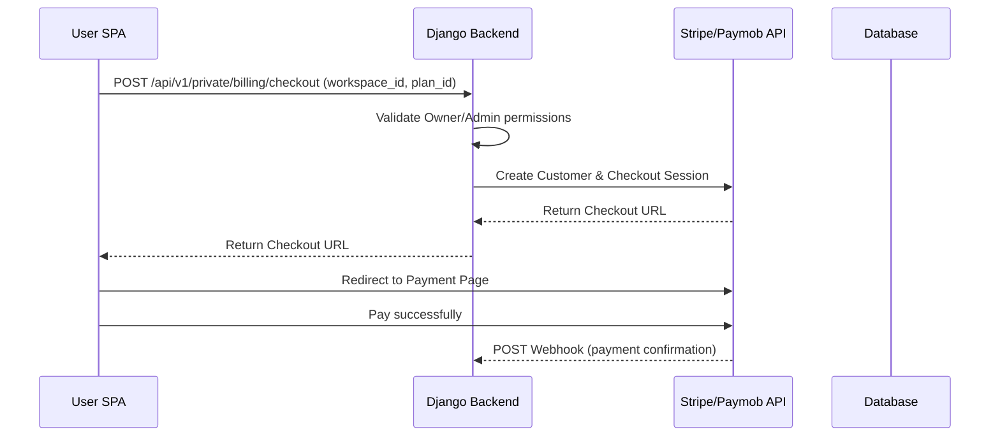

# Billing & Subscriptions

This document details the multi-gateway payment architecture, subscription lifecycle management, and account limits enforcement in AuraStack.

---

## 💳 1. Subscription Flow
AuraStack structures subscriptions on a per-workspace basis. The billing system is built on Stripe (global card payments) and Paymob (regional wallets/cash).

---

## 🛡️ 2. Webhook Validation & Async Jobs
To prevent Denial of Service (DoS) attacks on web workers and secure communications:

*   **Signature Verification:** All incoming webhook payloads are verified using the provider's signing secret (e.g., Stripe `stripe.Webhook.construct_event`).
*   **Asynchronous Processing:** Endpoints return an instant `200 OK` response to the payment gateway and offload signature checks and database updates to **Django Q2** background tasks.

---

## 🔒 3. Restricted Mode (Locked Workspaces)
AuraStack enforces plan limits gracefully:

1.  **Exceeding Limits:** When a workspace downgrades from `Pro` to `Free` while holding more than the allowed 3 members, the workspace is marked as `is_locked = True`.
2.  **State Injection:** The active workspace status is shared via Inertia Props with the Vue SPA.
3.  **UI Lockout:** If `is_locked` is true, the Vue SPA locks write operations and redirects the user to a premium warning dashboard prompting them to upgrade or manage their team.
