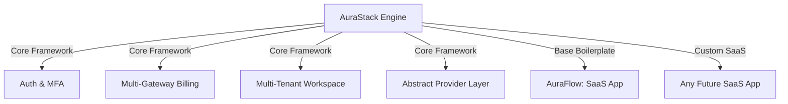

# التحليل الهندسي والاستراتيجي لمراجعة الـ CTO (AuraStack)

هذه المراجعة تنقل المشروع من مجرد **قالب كود (Boilerplate)** تقليدي إلى **منصة هندسية متكاملة (SaaS Engine / Framework)**. فيما يلي تحليل مفصل لكل نقطة مع الحلول المقترحة لتطبيقها في المعمارية والمستندات.

---

## 🏛️ التغيير الاستراتيجي الكبير: من AuraFlow إلى AuraStack



*   **الرؤية الجديدة:** سنقوم بفصل المشروع هندسياً. **AuraStack** (أو **AuraKit**) هو المحرك الأساسي (Core SaaS Engine)، بينما **AuraFlow** هو أول منتج مبني فوق هذا المحرك لإثبات كفاءته.

---

## 🔍 تحليل المشاكل العشرة والحلول الهندسية

### ١. الانتقال من الميزات (Features) إلى النتائج (Outcomes)
*   **التحليل:** المطور أو الـ CTO لا يشتري "MFA" لمجرد وجوده، بل يشتريه ليوفر وقت كتابة كود الأمان والحصول على شهادة الامتثال الأمني مثل SOC2.
*   **الحل في الـ PRD:** إعادة صياغة ميزات النظام بالكامل لتركز على القيمة التجارية والتسويقية (Value Proposition):
    *   *بدلاً من:* "دعم MFA" ⬅️ *تصبح:* "نظام مصادقة متوافق مع معايير SOC2 جاهز للمؤسسات (Enterprise-grade TOTP)."
    *   *بدلاً من:* "تعدد مساحات العمل" ⬅️ *تصبح:* "عزل أمني تام للبيانات (Multi-tenant BOLA-proof architecture) لضمان خصوصية بيانات الشركات."

### ٢. صياغة رؤية منتج قوية (Punchy Product Vision)
*   **التحليل:** الرؤية السابقة كانت أكاديمية وجافة.
*   **الحل:** اعتماد رؤية تركز على حل أكبر مشكلة يواجهها مطوري الـ SaaS (وهي ضياع الأسابيع الأولى في إعادة بناء البنية التحتية المتكررة):
    > *"أطلق منتج الـ SaaS القادم خلال أيام بدلاً من إضاعة أسابيع في إعادة بناء المصادقة، والفوترة، وتعدد المستأجرين، والبنية التحتية."*

### ٣. مبادئ المعمارية البرمجية (Architecture Principles)
*   **التحليل:** يشتري الـ CTO القالب لأنه يثق في تصميمه البرمجي. غياب هذه المبادئ يجعل الكود يبدو عشوائياً.
*   **الحل:** توثيق المبادئ التالية في التمهيد الفني:
    1.  **Modular Apps:** كل ميزة (Teams, Payments, Users) معزولة في Django App مستقل تماماً.
    2.  **Service Layer Pattern:** فصل منطق الأعمال (Business Logic) تماماً عن الـ Views والـ API Serializers لجعل الكود قابلاً للاختبار وإعادة الاستخدام.
    3.  **Provider Abstraction:** لا يوجد ارتباط مباشر بأي خدمة خارجية؛ كل شيء (بوابات الدفع، التخزين، الذكاء الاصطناعي) يتم عبر Interface موحد.
    4.  **Convention over Configuration:** هيكلية موحدة للملفات والمسارات لتقليل جهد التفكير أثناء التطوير.

### ٤. تجربة المطور (Developer Experience - DX)
*   **التحليل:** إذا استغرق تشغيل المشروع محلياً أكثر من 5 دقائق، سيفشل المنتج تجارياً.
*   **الحل:** وضع دليل تشغيل فوري ثلاثي الخطوات (Zero-Config Bootstrap):
    ```bash
    git clone ...
    cp .env.example .env
    docker compose up --build
    ```
    سيقوم Docker ببناء قاعدة البيانات، وتشغيل طابور المهام، وتجهيز سيرفر الواجهة الخلفية والأمامية معاً دون أي تدخل يدوي.

### ٥. نظام الاختبارات المتكامل (Testing Stack)
*   **التحليل:** القوالب بدون اختبارات هي كابوس صيانة.
*   **الحل:** توثيق البنية التحتية للاختبارات الحالية والتي تم بناؤها بالفعل:
    *   **Pytest & Pytest-Django:** للاختبارات السريعة.
    *   **Playwright (E2E Testing):** لاختبار تجربة المستخدم الحقيقية بالكامل (مثل رفع الصور والـ 2FA).
    *   **Factories (Factory Boy):** لتوليد بيانات الاختبار دون إرهاق قاعدة البيانات.
    *   **Coverage Reporting:** لتتبع نسبة تغطية الأكواد بالاختبارات.

### ٦. تكامل التطوير المستمر (CI/CD Pipeline)
*   **التحليل:** الـ CTO يتوقع أتمتة كاملة لفحص الجودة والأمان.
*   **الحل:** التخطيط لإضافة ملفات إعدادات GitHub Actions تقوم بالتالي مع كل Commit/PR:
    *   تشغيل **Ruff** للفحص التنسيقي والـ Linting.
    *   تشغيل الفحص الأمني للأكواد والمكتبات (Safety / Bandit).
    *   تشغيل باقة اختبارات Pytest و Playwright.

### ٧. المراقبة والتحليل (Observability)
*   **التحليل:** كيف نعرف بوجود الأخطاء في الإنتاج؟
*   **الحل:** تخطيط إدماج أدوات المراقبة بشكل اختيارى وسهل التفعيل عبر الـ `.env`:
    *   **Sentry:** لتتبع الأخطاء البرمجية فور حدوثها في الإنتاج.
    *   **Structured JSON Logging:** لتحليل السجلات بسهولة عبر أنظمة مثل Cloudwatch أو Datadog.
    *   **Django Health Check:** مسار `/health` للتحقق من سلامة قاعدة البيانات وطابور المهام.

### ٨. معالجة طابور المهام (Queue Provider Abstraction)
*   **التحليل:** فرض `Django Q2` يزعج الشركات التي تفضل الموثوقية العالية لـ `Celery` أو خفة `Huey`.
*   **الحل:** تصميم واجهة تجريدية لمهام الخلفية (`BaseQueueProvider`):
    *   الوضع الافتراضي للتطوير المحلي: `Django Q2` (لأنه لا يتطلب Redis ويعمل مباشرة على قاعدة البيانات).
    *   وضع الإنتاج: توفير خطوط ربط جاهزة للتحويل لـ `Celery` بمجرد تغيير متغير في الـ `.env`.

### ٩. واجهة الذكاء الاصطناعي الموحدة (Unified AI Provider Layer)
*   **التحليل:** الـ AI حالياً هو نقطة البيع الأقوى. دمج واجهة موحدة يرفع قيمة المنتج بشكل خيالي.
*   **الحل:** بناء `AIProvider` مجرد يدعم التبديل السلس بين الموفرين الأساسيين:
    ```python
    # التبديل في الـ .env فقط دون تعديل سطر كود واحد!
    AI_PROVIDER=openai  # أو gemini, anthropic, deepseek
    ```
    يتكفل الكود الداخلي بترجمة الـ Prompt والتعامل مع الـ SDK الخاصة بالشركة المختارة.

---

## 📈 خطة العمل لـ Version 1 (Roadmap to V1 Launch)

لتحقيق التوازن بين "السرعة" و "الكمال"، سنقوم بتقسيم المتطلبات المتبقية لـ V1 إلى فئتين:

### الفئة أ: متطلبات الإطلاق الأساسية لـ v1 (المنتج القابل للبيع):
1.  **Abstract Queue Provider:** فصل كود المهام الخلفية ليدعم دجانغو Q2 كبداية مع سهولة التحويل لـ Celery.
2.  **Abstract AI Provider Layer:** بناء واجهة استدعاء الذكاء الاصطناعي الموحدة (Gemini / OpenAI / Claude).
3.  **Docker Compose Ready for Production:** إعداد ملف تشغيل للإنتاج يدعم Gunicorn و Whitenoise وعزل الحاويات بشكل احترافي.
4.  **GitHub Actions Workflow:** إضافة أتمتة الاختبارات والفحوصات البرمجية.

### الفئة ب: الميزات التكميلية (تضاف لاحقاً كـ Updates مجانية للمشترين):
1.  **Observability (Sentry & Prometheus Metrics).**
2.  **Feature Flags (التحكم بالميزات للمستخدمين ديناميكياً).**
3.  **Audit Logs (سجلات النشاطات التفصيلية للشركات).**
