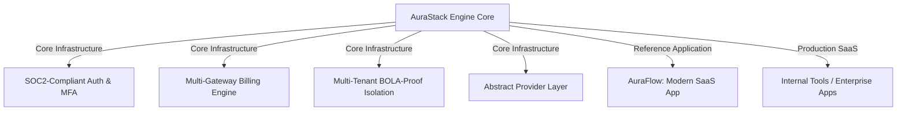

# 🏛️ Technical & Strategic Engineering Analysis — AuraStack Engine

This document analyzes the engineering vision elevating **AuraStack** from a conventional boilerplate into an enterprise-ready **SaaS Engine & Framework**.

---

## 🏛️ Strategic Vision: Core SaaS Engine vs Product Applications



* **The Vision:** Decouple core engine capabilities. **AuraStack** provides the foundational SaaS framework (Auth, Multi-Tenancy, Billing, Task Queues), while **AuraFlow** serves as the initial reference implementation.

---

## 🔍 Core Architectural Pillars & Engineering Solutions

### 1. Outcomes Over Features
* **Value Proposition:** Enterprise buyers evaluate SaaS foundations based on security standards and development velocity:
  * *Enterprise Auth:* SOC2-compliant Time-based One-Time Password (TOTP) Multi-Factor Authentication.
  * *Multi-Tenancy:* BOLA-proof row-level data isolation guaranteeing tenant data privacy.

### 2. Punchy Product Vision
* *"Launch your next production SaaS or internal tools platform in days rather than wasting weeks rebuilding authentication, billing, multi-tenancy, and background task infrastructure."*

### 3. Core Software Design Principles
1. **Modular Apps:** Domain-driven isolation across `teams`, `payments`, and `users`.
2. **Service & Selector Pattern:** Complete separation of business logic from views and serializers for testability and zero $N+1$ database queries.
3. **Provider Abstraction:** Clean interfaces for payment gateways, task queues, and storage providers.
4. **Convention Over Configuration:** Standardized file structures minimizing cognitive overhead.

### 4. Zero-Config Developer Experience (DX)
* Local setup in 3 simple commands:
  ```bash
  git clone <repo-url>
  cp .env.example .env
  docker-compose up --build
  ```

### 5. Multi-Layer Quality Assurance (QA)
* **Pytest & Pytest-Django:** Fast unit and integration assertion runs.
* **Playwright E2E:** Real Chromium browser automation for visual, auth, and theme verification.
* **Coverage & Ruff:** Automated linting, formatting, and test coverage gates.

### 6. Automated CI/CD Workflows
* GitHub Actions (`ci.yml`) enforcing linter execution (Ruff), migration consistency checks (`makemigrations --check`), and full Pytest execution on push/PR.

### 7. Production Observability & Health Checking
* Structured logging, Sentry error capturing integration, and dedicated system healthcheck endpoints (`/auth/login/` / container checks).

### 8. Background Task Queue Abstraction
* Database-backed task queues using Django-Q2 for simple zero-dependency local development, with clean interfaces to swap to Celery or Redis in high-throughput environments.
